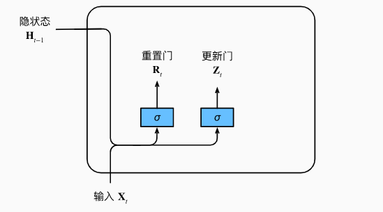
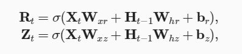
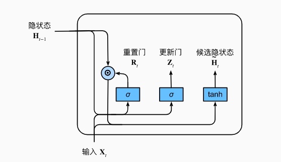
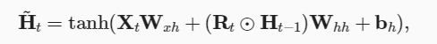
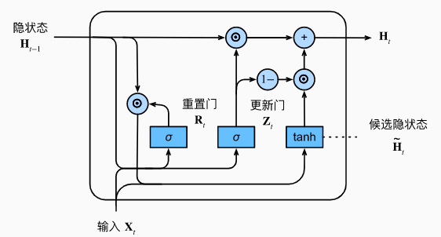
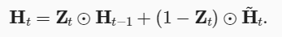

## 1.GRU

### 1.1GRU作用
GRU（Gate Recurrent Unit）是循环神经网络（RNN）的一种，可以解决RNN中不能长期记忆和反向传播中的梯度等问题，与LSTM的作用类似，不过比LSTM简单，容易进行训练。

**GRU在LSTM基础上进行两大改进:**
1.将三个门：输入门、遗忘门、输出门变为两个门：**更新门$ (Update Gate) z_t$ 和 重置门 $(Reset Gate) r_t$**
2.将 (候选) 单元状态 与 隐藏状态 (输出) 合并，**即只有当前时刻候选隐藏状态 $\tilde{h_t}$ 和 当前时刻隐藏状态 $h_t$**

### 1.2GRU计算
(1)计算重置门$R_t$和更新门$Z_t$

(2)计算候选隐藏状态$\widetilde{H_t}$

(3)计算最终隐藏状态$H_t$

**每当更新门$Z_t$接近1时，GRU就倾向只保留旧状态，而当更新门$Z_t$接近0时，新的隐状态就会接近候选隐状态**。这些设计可以帮助我们处理循环神经网络中的**梯度消失问题**， 并更好地捕获时间步距离很长的序列的依赖关系。 

## 2.GRU和LSTM比较
GRU是LSTM的一种变体，综合来看：
1、两者的性能在很多任务上不分伯仲。
2、**GRU 参数相对少更容易收敛，但是在数据集较大的情况下，LSTM性能更好**。
3、GRU只有两个门（update和reset），LSTM有三个门（forget，input，output），在参数量上，**GRU是传统RNN的3倍，LSTM是传统RNN的4倍**。
LSTM还有许多变体，但不管是何种变体，都是对输入和隐层状态做一个线性映射后加非线性激活函数，重点在于额外的门控机制是如何设计，用以控制梯度信息传播从而缓解梯度消失现象。

## 3. 学习链接
**GRU介绍及实现：** https://zh-v2.d2l.ai/chapter_recurrent-modern/gru.html
