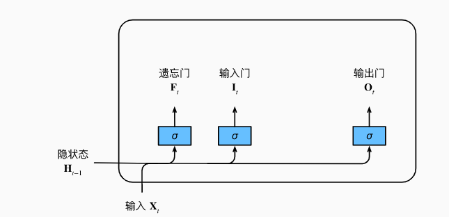
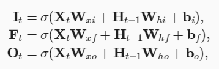
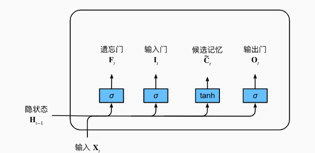
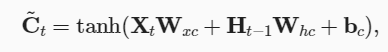
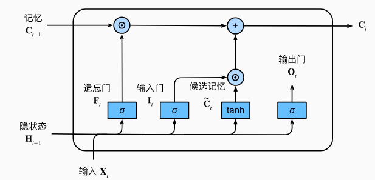
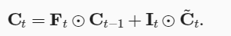
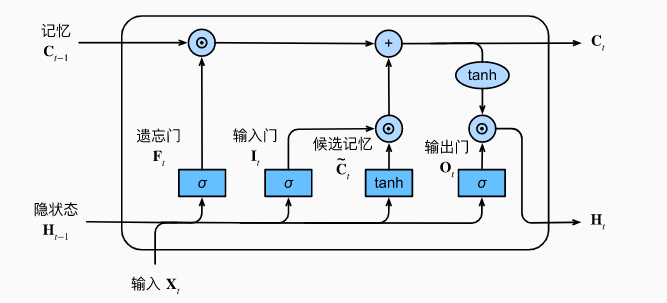
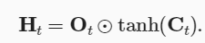

## 1. LSTM

## 1.1 LSTM作用
长期以来，隐变量模型存在着**长期信息保存和短期输入缺失**的问题。 解决这一问题的最早方法之一是长短期存储器（long short-term memory，LSTM）

 长短期记忆网络引入了记忆元（memory cell），或简称为单元（cell）。**记忆元是隐状态的一种特殊类型， 它们与隐状态具有相同的形状，其设计目的是用于记录附加的信息**。

### 1.2 LSTM计算步骤
(1)计算输入门$I_t$、遗忘门$F_t$和输出门$O_t$

使用以上公式计算$I_t$、$F_t$、$O_t$,其中$\sigma$为sigmoid激活函数.

(2)计算候选记忆$\widetilde{C_t}$

**候选记忆$\widetilde{C_t}$是当前记忆元的候选值，它由输入$x_t$和当前隐状态$h_{t-1}$共同决定**.

(3)更新记忆元$C_t$

**$F_t$用于控制旧记忆$C_{t-1}$的保留，$I_t$用于控制新记忆$\widetilde{C_t}$的加入**.

(4)计算输出$h_t$

**$O_t$控制输出$h_t$中哪些信息被保留，哪些信息被丢弃**.

### 1.3 LSTM结构分析
**在LSTM中，可以看做$C_t$中存的是较长期的记忆，而$h_t$中存的是较短期的记忆。** 通过遗忘门来讲记忆元中的相对无用的信息去掉，通过候选记忆来将新信息加入记忆单元，通过输出门来控制输出。

相比于传统RNN结构，LSTM通过将文本信息表示成更细致的形式，帮助模型更好地保留长时文本信息。

### 1.4 为什么LSTM能解决RNN不能长期依赖的问题
详情见： http://t.csdnimg.cn/EILAA ；https://zhuanlan.zhihu.com/p/28749444
大多数遗忘门的偏导值趋于1。也就缓解了由于小数连乘导致的梯度消失问题。

## 2.学习资料
**LSTM介绍及实现：** https://zh-v2.d2l.ai/chapter_recurrent-modern/lstm.html#

