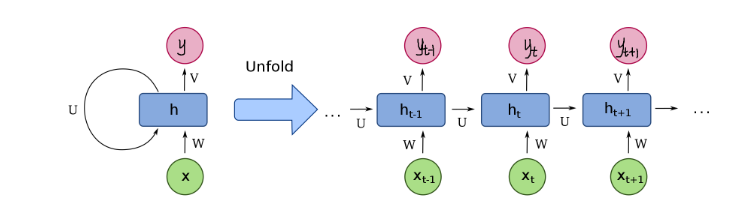
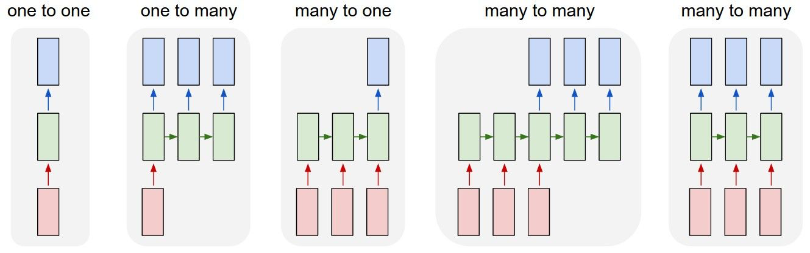
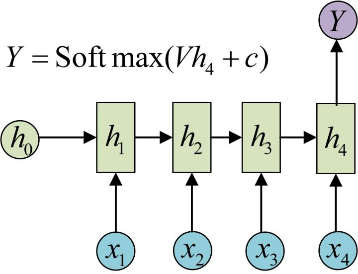
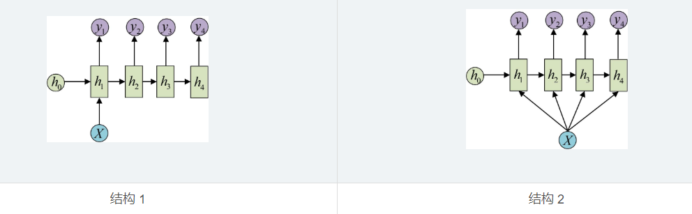
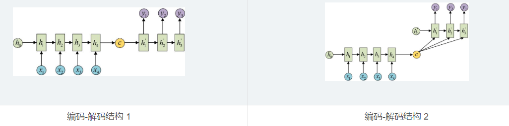
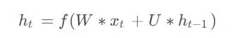
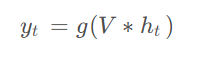
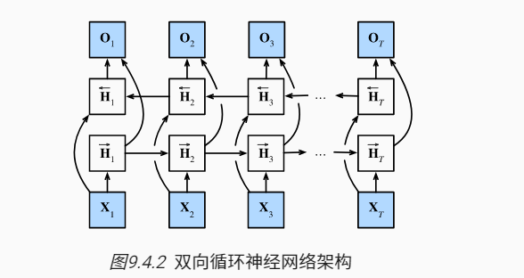
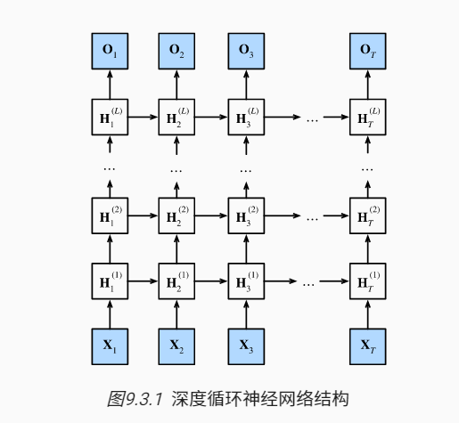

## 1. RNN
### 1.1 RNN作用
RNN的特殊结构使其能够处理时序数据。
RNN 的网络结构如下图所示。具体而言，隐藏层内部节点间有了连接，并且**隐藏层的输入包括了输入层的输出和上一时刻隐藏层的输出**。RNN 最重要的特点是每一步的**参数共享**。

### 1.2 RNN种类
RNN 有多种结构，分别为一对一、一对多、多对一和多对多。

**多对一结构：**
应用：常用于**序列分类问题。**

**一对多结构：**
应用：常用于**序列生成问题，** 例如图片描述生成。

**多对多结构：**
应用：机器翻译，阅读理解，文本摘要等

### 1.3 RNN计算

隐藏层计算：

其中f为隐藏层的激活函数。

输出层计算：

其中g为输出层的激活函数。

### 1.4 RNN局限
传统RNN在解决长序列之间的关联时，表现很差，原因在于反向传播时，过长的序列导致梯度的计算异常，发生**梯度消失或爆炸。**

### 1.5 梯度裁剪
在训练RNN过程中容易发生梯度爆炸问题，而通过进行梯度裁剪可以有效缓解这个问题。

梯度裁剪有两种主要形式：**梯度范数裁剪**（Gradient Norm Clipping）和**梯度值裁剪**（Gradient Value Clipping）。

#### 1.5.1 **梯度范数裁剪（Gradient Norm Clipping）**
梯度范数裁剪**通过调整整个参数梯度向量来保持其总体范数不超过特定阈值。**它不关注单个梯度的值，而是关注所有梯度构成的整体范数。如果梯度的范数超过了指定的阈值，则会按比例缩小梯度向量的每个分量，使得整体范数等于或小于该阈值。
这种方法的数学表达为：
**如果$∥g∥>c$，则更新梯度$g$为$ g × c /∥g∥$其中$∥g∥$是梯度向量的范数，$c$是预设的阈值.**

**实现： torch.nn.utils.clip_grad_norm_**

#### 1.5.2 **梯度值裁剪（Gradient Value Clipping）:**
梯度值裁剪对梯度向量中的每个元素独立地进行裁剪，确保它们的值不会超出指定的范围。**对于每个梯度 $gᵢ$ ，如果 $gᵢ > c$，那么 $gᵢ$ 就被设置为$c$；如果 $gᵢ < -c$，那么 $gᵢ$ 就被设置为$-c$。**

**实现： torch.nn.utils.clip_grad_value_**

### 1.6 双向RNN

双向层的使用在实践中非常少，并且仅仅应用于部分场合。 例如，填充缺失的单词、词元注释（例如，用于命名实体识别） 以及作为序列处理流水线中的一个步骤对序列进行编码（例如，用于机器翻译）

### 1.7 深度RNN

## 学习链接
**梯度裁剪：** http://t.csdnimg.cn/oHtQy
**RNN介绍：** http://t.csdnimg.cn/KUPYX ；http://t.csdnimg.cn/mkYQA
**数据集：** http://t.csdnimg.cn/TqDdA

