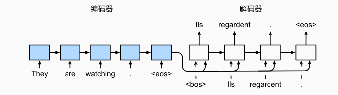

## Seq2Seq作用
能够使用**长度可变**的序列作为输入， 将其转换为固定形状的隐状态，并转换成**不定长的输出**

## Seq2Seq模型结构

**encoder:**
在编码器中，使用一个函数$f$来描述循环神经网络的循环层所做的变换：

其中$x_t$为时间步$t$的输入，$h_t$为时间步$t$的隐状态。
然后，编码器通过选定的函数$q$， 将所有时间步的隐状态转换为**上下文变量$c$**，即：
$$c = q(h_1, h_2, ..., h_T)$$
一般情况下，选择$q(h1,h2,...,h_T)=h_T$，即使用最后时刻隐状态作为上下文变量。

**decoder:**
**编码器会把上下文变量$c$作为解码器输入**， 解码器会使用一个循环神经网络来生成输出序列。
来自训练数据集的输出序列$y_1,y_2,...,y_{T'}$， 对于每个时间步$t'$ ， 解码器输出的概率$\hat{y}_t'$， 取决于先前的输出子序列 $y_1,y_2,...,y_{t'-1}$ 和上下文变量$c$,即：
$$\hat{y}_t' = g(y_{1:t'-1}, c)$$
其中$g$是一个非线性函数，如softmax。

**损失函数：**
使用多分类损失函数，但需要**遮蔽不相关项**，比如填充项。
可以使用**nn.CrossEntropyLoss(ignore_index=pad_id)**实现

**Teacher Forcing**:
在训练过程中，使用**强制教学**，即在每个时间步$t$，使用真实的标签$y_t$作为输入，而不是预测的$\hat{y}_t'$。

**Beam Search:**
**在预测时要避免因为每次只选择当前得分最高的而丢失全局得分最高的结果**，可以考虑使用Beam Search算法，即在每一步选择得分最高的$k$个候选结果，然后在下一步选择得分最高的$k$个结果，以此类推，直到达到预设的最大长度或遇到结束符。

**参考实现：** https://github1s.com/budzianowski/PyTorch-Beam-Search-Decoding/blob/master/decode_beam.py

## 学习链接
**Seq2Seq代码实现：** https://github.com/bentrevett/pytorch-seq2seq
**Seq2Seq详细介绍：** https://zh-v2.d2l.ai/chapter_recurrent-modern/seq2seq.html