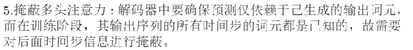

## Transformer作用
Transformer通过**堆叠多个Transformer层**来实现序列到序列的学习，并在每个层中使用残差连接和层归一化来提高模型的能力，在机器翻译、文本摘要、图像描述、对话生成等任务上都有着卓越的表现。

## Transformer模型结构

使用Layer Normalization（LN）而不使用Batch Normalization（BN）的原因：**LN是在同一个样本中不同神经元之间进行归一化**，而BN是在同一个batch中不同样本之间的同一位置的神经元之间进行归一化。BN不适合用于**序列长度会变的nlp**中。

**作用是改变改变输出形状，使得Transformer层的输出和输入形状相同，便于堆叠增加网络深度。**

## 学习资源
**code:** https://datawhalechina.github.io/learn-nlp-with-transformers/#/./%E7%AF%87%E7%AB%A02-Transformer%E7%9B%B8%E5%85%B3%E5%8E%9F%E7%90%86/2.2.1-Pytorch%E7%BC%96%E5%86%99Transformer

