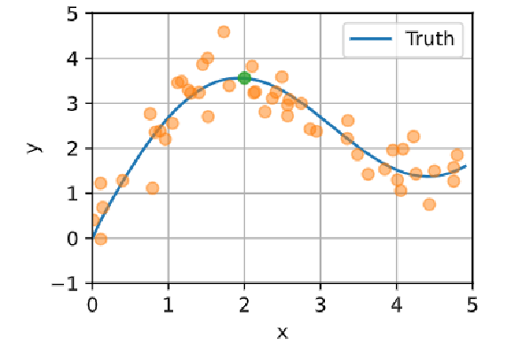
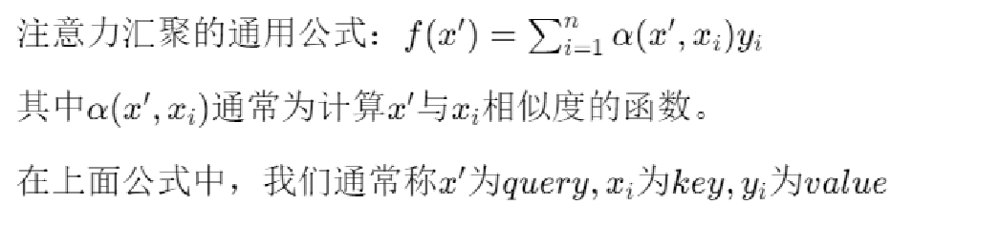
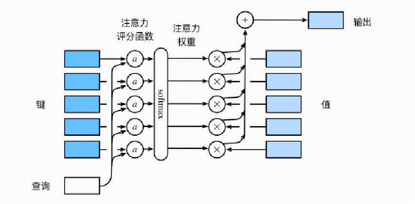
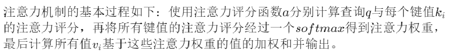
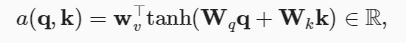
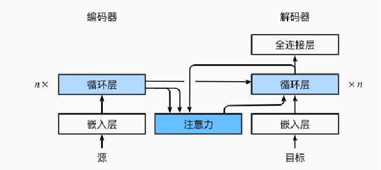
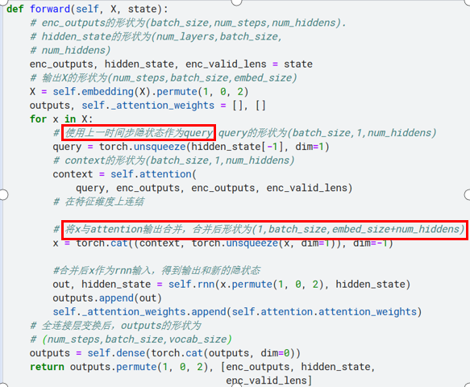
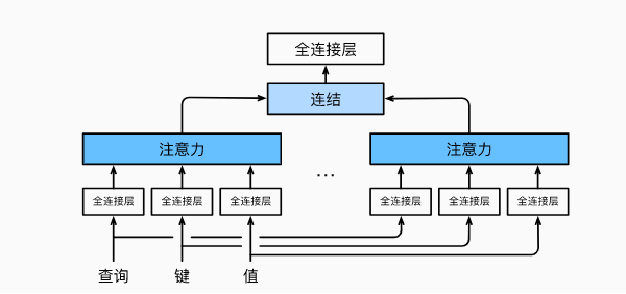
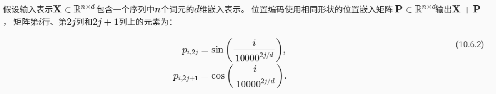

## 1.注意力机制作用
在深度学习的过程中，注意力机制是一种重要的技术，它可以**帮助模型学习到输入序列中不同位置的重要性**，从而提高模型的性能。

## 2.注意力机制原理

在上图中，我们想要去预测绿点的值，不难想到应该给与其接近的样本赋予更高的权重，而给与远离的样本赋予更低的权重。注意力机制的思路与此类似。

**注意力汇聚通用公式**

**注意力机制架构**

## 注意力机制的实现

选择不同的注意力评分函数会导致不同的注意力汇聚操作。以下是两种常见的评分函数。

### 加性注意力机制
加性注意力（additive attention）的评分函数为：

### 缩放点积注意力
使用点积可以得到计算效率更高的评分函数， 但是点积操作要求查询和键具有相同的长度$d$，因此需要对其进行缩放。缩放点积注意力的评分函数为：
**$$a(q,k)=\frac{q^T k}{\sqrt{d}}$$**
该做法没有可学习参数，**一般需要使用dropout避免过拟合**。

## 3.使用注意力机制的seq2seq
#### $使用注意力机制改进seq2seq的动机：$
**在机器翻译过程中，生成的词可能与源句子中不同的词相关**。希望在翻译某个位置时，能关注到原句子的对应部分。在seq2seq原始架构中，encoder只将最后时间步的隐状态传入decoder,很难实现以上需求.而注意力机制则能较好做到这一点。

这个新的基于注意力的模型与之前模型基本相同，只是encoder传输到decoder的**上下文变量**有区别。
在之前的模型中，上下文变量$c$为最后时间步隐状态$h_T$。
在这个基于注意力的模型中，每个时间步上下文变量$c_{t'}$计算计算公式如下：
 $$\mathbf{c}_{t'} = \sum_{t=1}^T \alpha(\mathbf{s}_{t' - 1}, \mathbf{h}_t) \mathbf{h}_t,$$
 其中$s_{t' - 1}$为时间步$t'-1$时解码器的隐状态，$h_t$为编码器t时刻的隐状态。

在以上公式中不难看出，模型使用解码器上一时间步隐状态$s_{i-1}$作为query,将编码器所有时间步的隐状态$h_i$既当key又当value。

### 实现

## 4.多头注意力

### 多头注意力作用
在卷积神经网络中，我们经常使用多个卷积核来抽取图片的不同特征。
在注意力机制中，**我们希望模型可以基于相同的注意力机制学习到不同的行为， 然后将不同的行为作为知识组合起来，捕获序列内各种范围的依赖关系**。

### 实现方法
**使用全连接层来学习得到h组不同的线性投影**来变换查询、键和值。 然后，这组变换后的查询、键和值将并行地送到注意力汇聚中。**最后，将这个注意力汇聚的输出拼接在一起， 并且通过另一个全连接层**， 以产生最终输出。

## 5.自注意力和位置编码
### 自注意力作用
对于一个序列，经过一个自注意机制层后能得到另一个相同长度的序列，**新的序列包含更多上下文语义信息**。

### 自注意力原理

**在自注意力机制，$a^1,a^2..,a^n$既是query,又是key和value**.

##### $对于a^1,新序列对应项b^1计算过程如下：$
(1)使用$a^1$作为当前查询，**使用$a^i$作为第$i$个隐状态的key,计算$a^1$与第i个隐状态的相似度**，得到$\alpha_{1,i}$，
(2)将所有$\alpha_{1,i}$放入softmax层得到注意力分数$\alpha^{'}_{1,i}$,
(3)最后使用$a^i$作为value,**基于注意力分数进行加权平均即可得到$b^1$**.用相同的方式可出求$b^2..,b^n$.新序列$b^1..,b^n$通常能比原序列包含更多上下文语义信息。$

### 位置编码作用
在处理词元序列时，循环神经网络是逐个的重复地处理词元的， 而自注意力则因为并行计算而放弃了顺序操作。**为了使用序列的顺序信息，通过在输入表示中添加位置编码来注入绝对的或相对的位置信息**,具体实现方法如下： 

