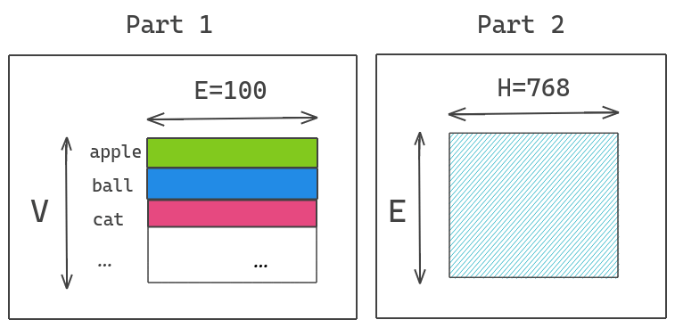
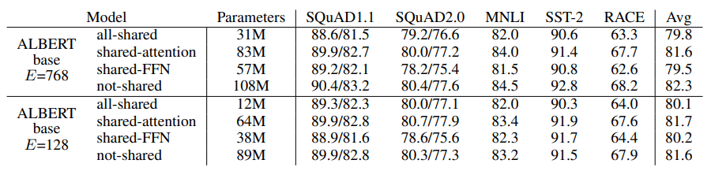

## ALBERT(A Lite BERT)作用

## ALBERT的改进点
1.embedding层参数因式分解
2.跨层参数共享
3.将NSP任务改为SOP任务

#### 1.embedding层参数因式分解
ALBERT不直接将原本的one-hot向量映射到hidden space size of H ，而是分解成两个矩阵，原本参数数量为**V ∗ H** ，V 表示的是Vocab Size。分解成两步则减少为**V ∗ E + E ∗ H**，当H 的值很大时，这样的做法能够大幅降低参数数量。

#### 2.跨层参数共享
传统Transformer的每一层参数都是独立的，包括各层的self-attention、全连接。这样就导致层数增加时，参数量也会明显上升。ALBERT作者尝试**将所有层的参数进行共享**，相当于只学习第一层的参数，并在剩下的所有层中重用该层的参数，而不是每个层都学习不同的参数。

#### 3.将NSP任务改为SOP任务
ALBERT提出了另一个任务——**句子顺序预测**。关键思想是：
- 从同一个文档中取两个连续的句子作为一个正样本
- 交换这两个句子的顺序，并使用它作为一个负样本

## 总结
模型提升的是**训练时间**而不是**Inference**时间。Inference时间并未得到改善。
在相同的训练时间下，ALBERT得到的效果确实比BERT好
在相同的Inference时间下，ALBERT base和large的效果都没有BERT好，而且差了2-3个点。

## 学习资源
**论文解读**: https://blog.csdn.net/qq_37236745/article/details/108846706