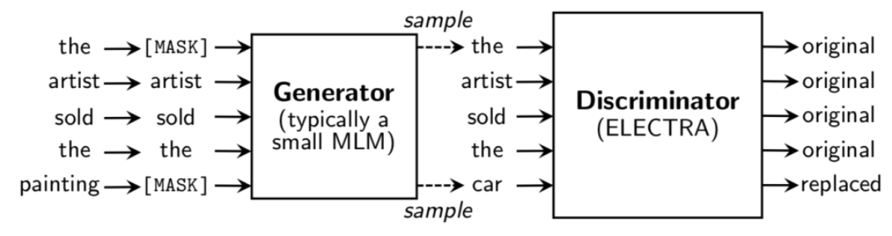

## ELECTRA作用
全称 Efficiently Learning an Encoder that Classifies Token Replacements Accurately，高效训练编码器准确分类替换标志。

能够在较小的预训练成本下得到较好的效果。

## ELECTRA模型结构

**Generator和Discriminator可以看作两个BERT**，生成器的任务是**MLM**，判别器的任务是**Replaced Token Detection**，判断哪个字被替换过。

两者同时训练，但判别器的梯度不会传给生成器，目标函数如下：

因为判别器的任务相对来说容易些，RTD loss相对MLM loss会很小，因此加上一个系数，作者训练时使用了50。

另外要注意的一点是，**在优化判别器时计算了所有token上的loss，而以往计算BERT的MLM loss时会忽略没被mask的token**。作者在后来的实验中也验证了在所有token上进行loss计算会提升效率和效果。

### 实验tips
1.**权重共享**
生成器和判别器的共享嵌入层权重。作者认为生成器对embedding有更好的学习能力，因为在计算MLM时，softmax是建立在所有vocab上的，之后反向传播时会更新所有embedding，而判别器只会更新输入的token embedding。
2.**较小的生成器**
生成器的大小在判别器的1/4到1/2之间效果是最好的，过强的生成器会增大判别器的难度。

## 学习资源
**论文解读**：https://blog.csdn.net/xixiaoyaoww/article/details/105036305

