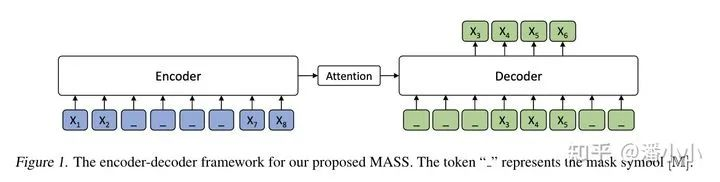
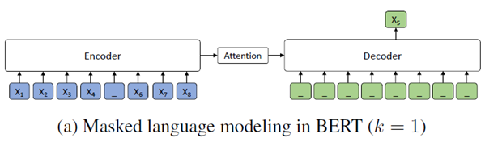
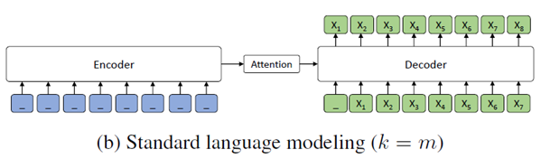

## MASS 作用
MASS 全称 Masked Sequence to Sequence Model with Attention。
作者发现**BERT并不适用于生成式任务**之后,故将BERT中的预测token改为了预测fragment(连续片段)，同时采取了整个sequence-to-sequence modeling，取代了BERT仅仅使用encoder作为建模的做法，使得MASS**更加适合生成式的任务**。

## MASS 模型结构

模型过程如图所示，**Encoder端会连续mask掉输入序列中的一部分token**，得到序列的隐变量，并输入Decoder,decoder会将除mask掉的token外都屏蔽掉，进行解码。
（1）**decoder端其它词（在encoder端未被屏蔽掉的词）都被屏蔽掉，以鼓励decoder从encoder端提取信息来帮助连续片段的预测**，这样能促进encoder - 注意力 - decoder结构的联合训练；
（2）为了给decoder提供更有用的信息，**encoder被强制去抽取未被屏蔽掉词的语义**，以提升encoder理解源序列文本的能力；
（3）**让decoder预测连续的序列片段，以提升decoder的语言建模能力**。

k是模型的主要超参数，它规定mask掉的词数。
k=1时，模型相当于Bert.
k=m时，模型相当于GPT。
实验得出了当超参数**k取50%的时候效果最好**，此时相当于较好地**平衡了encoder和decoder获取信息的能力**。

## 结果
经过预训练后，能够在只通过单语预训练的情况下得到较好的机器翻译结果。