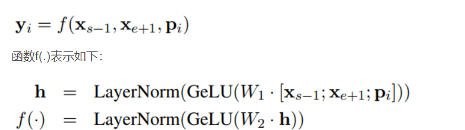

## SpanBert作用
修改了预训练任务，让模型在一些需要 Span 的下游任务取得更好表现，特别在一些与 Span 相关的任务，如**抽取式问答**。

## SpanBert模型结构

### SpanBert改进点
1.**改进mask方法**
**每次mask一个片段**。根据几何分布，先随机选择一段（span）的长度，之后再根据均匀分布随机选择这一段的起始位置，最后按照长度遮盖。文中使用几何分布取 p=0.2，最大长度只能是 10，利用此方案获得平均采样长度分布。

2.加入**SBO** 训练目标
Span Boundary Objective 是该论文加入的新训练目标，**希望被遮盖 Span 边界的词向量，能学习到 Span 的内容**。具体做法是，在训练时取 Span 前后边界的两个词，这两个词不在 Span 内，然后用这两个词向量加上 Span 中被遮盖掉词的位置向量，来预测原词。

这样做的目的是：增强了 BERT 的性能，为了让模型让模型在一些需要 Span 的下游任务取得更好表现，特别在一些与 Span 相关的任务，如抽取式问答。

3.去除NSP任务
XLNet 中发现NSP不是必要的，而且两句拼接在一起**使单句子不能俘获长距离的语义关系**，所以作者剔除了NSP任务，直接一句长句做MLM任务和SBO任务。

这样做的目的是：剔除没有必要的预训练任务，并且使模型获取更长距离的语义依赖信息

## 学习资源
**模型解读**： https://blog.csdn.net/qq_32223859/article/details/106351513
**code**: https://github.com/facebookresearch/SpanBERT/blob/main/code/pytorch_pretrained_bert/modeling.py
**SpanBert论文**：https://arxiv.org/abs/1907.10529
