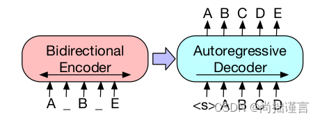
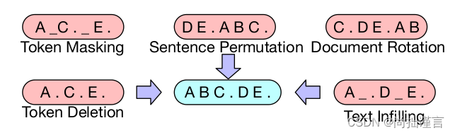

## BART作用
BART(Bidirectional and Auto-Regressive Transformers),结合了BERT和GPT两种模型思路，使得它**不仅具有双向编码的优势，也具有单向自回归编码的优势**。既能完成生成任务，又能用于语义理解。

## BART模型结构
BART沿用了**标准的Transformer结构**，也就是Encoder-Decoder的Transformer。
BART的**预训练**主要依据以下两步走的思路：
1）通过随机噪声函数（说白了就是能够制造破坏文档结构的任何方法）来**破坏文章结构**；
2）逼迫模型能够学会将结构已经被破坏了的文章进行**重构**，使文章变回原来的样子；

#### 几种具体的打破文章结构的方式
1.单Token级别的掩码（**Token Masking**），这个和BERT一样，按一定比例随机采样Token进行[MASK]；
2.Token级别的丢失（**Token Deletion**），直接随机删掉文章中的一些单词（注意作者没有提到deletion的Token是否可以连续，因此猜测这种方式同样也包含了连续几个Token被delete的情况），这和MASK可不一样，MASK的话模型至少知道原Token在哪，**而直接deletion的话，模型不仅需要知道原Token是啥，还需要知道原Token都在哪些位置**，这无形就提高了模型的预测能力。
3.片段级别的Token MASK（**Text Infilling**），这个在上文已经解释过了，这里作者给出了片段选取的依据，即**通过均值λ为3的泊松分布对span text进行采样**，比如有长度为0的，长度为3的，长度为5的等等片段，**将它们分别只用一个MASK替换**。
4.句序打乱（**Sentence Permutation**），将完整的句子在原文中的顺序打乱，让模型学习它们原来应该在什么位置。
5.文章旋转（**Document Rotation**），其实就是随机在文章中取一个词，并以该词为基点将文章旋转，然后再让模型学习原文的起始Token是啥。

#### 微调BART
1.句子级分类任务
在句尾加[CLS]，将这个词的embedding作为句子的embedding。
2.Token级别的分类任务
用Decoder输出的每一个Token的hidden state，即对每个Token进行分类。
3.文本生成任务
模型一个原始文本和一个目标文本，编码器接收原始文本，解码器解码出预测文本，并和目标文本求损失

## 学习资源：
**论文解读**： https://blog.csdn.net/qq_36583400/article/details/131394337