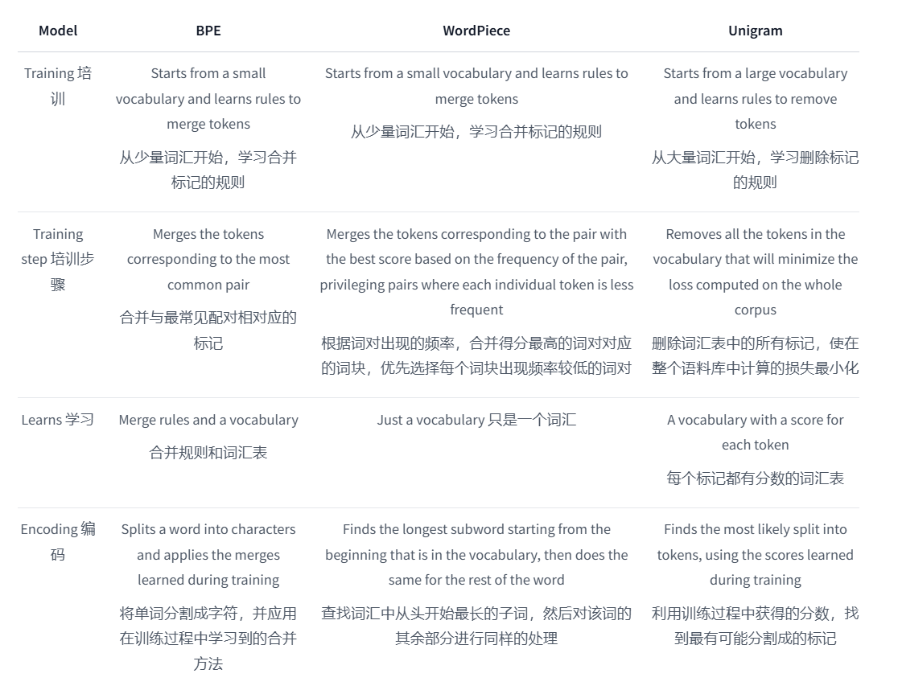
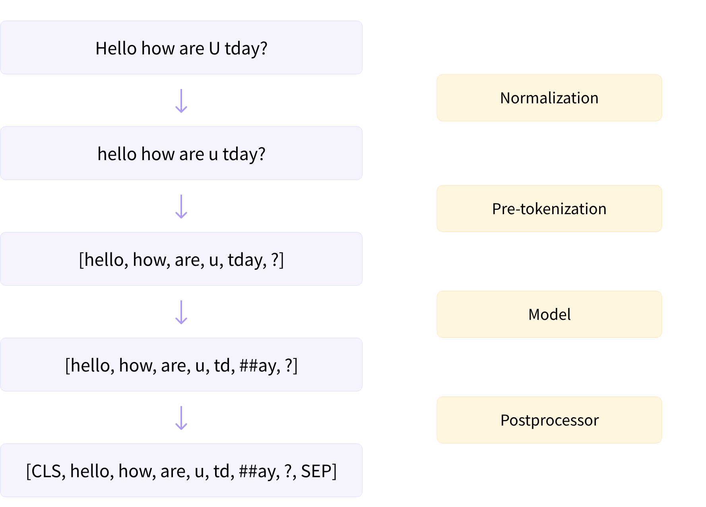

## 常用算法

## tokenizer一般流程

**规范化**：规范化步骤包括一些一般的清理工作，如去除不必要的空白、降低字母大小写和/或去除重音。
**预标记化**：把句子分成词汇列表。
### 1.BPE(Byte-Pair Encoding tokenization)
BPE 首先将词分成单个字符，然后依次用另一个字符替换频率最高的一对字符 ，直到循环次数结束。
### 2.WordPiece(Word-Piece tokenization)
WordPiece是贪心的最长匹配搜索算法。基本流程：
1.首先初始化词表，词表包含了训练数据中出现的所有字符。
2. 然后两两拼接字符，统计字符对加入词表后对语言模型的似然值的提升程度。
3. 选择提升语言模型似然值最大的一组字符对加入词表中。

反复2和3，直到词表大小达到指定大小。

### 3.Unigram(Unigram tokenization)

## 学习资源：
**BPE**:https://huggingface.co/learn/nlp-course/chapter6/5?fw=pt
**WordPieces:**https://huggingface.co/learn/nlp-course/chapter6/6?fw=pt
**Unigram**:https://huggingface.co/learn/nlp-course/chapter6/7?fw=pt

**中文教程**：https://blog.csdn.net/raelum/article/details/132225006