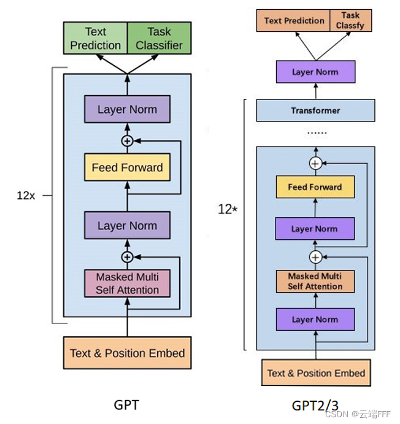
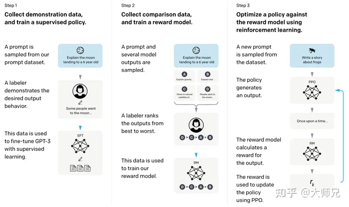

## GPT 作用
在自然语言处理问题中，可从互联网上下载大量无标注数据，而针对具体问题的有标注数据却非常少，GPT 是一种半监督学习方法，它致力于**用大量无标注数据让模型学习 “常识”**，以缓解标注信息不足的问题。其具体方法是在针对有标签数据训练 Fine-tune 之前，用无标签数据预训练模型 Pretrain，并保证两种训练具有同样的网络结构。

## GPT模型结构

#### GPT-1 模型
GPT-1 模型大体遵循了原始 transformer，训练了 **12 层的 Decoder-only Transformer**、具备 masked-self attention head（768 维状态和 12 个注意力头），具体实现细节为:

- 我们训练了一个12层的 Decoder-only Transformer，使用了带有 masked-attention head 的结构（768维状态和12个注意力头）。
- 对于 position-wise FFD 网络，我们使用了3072维的内部状态
**Adam最大学习率为 2.5e-4**。（之后GPT-3针对这个模型大小使用了6e-4）
- 学习率衰减：在前2000次更新中线性增加到最大值，然后使用余弦计划将其退化为0
- 我们使用 64 个随机抽样的连续序列，每个序列包含 512 个 token，进行100个 epoch 的训练
- 由于 **Layernorm** 在整个模型中被广泛使用，简单的 N ( 0 , 0.02 )  权重初始化就足够了
- 使用了 40,000 merges 的 **Byte Pair Encoding（BPE）**词汇表。
- 为了正则化，residual, embedding, 和 attention 都设置了 0.1 的 dropout
- 采用了修改过的 L2 正则化方法，在所有非偏置或增益权重上设置 w = 0.01 
- 激活函数采用了**高斯误差线性单元（GELU）**
- 我们使用了**学习得到的 position embedding**，而不是原始工作中提出的正弦版本
- 对于微调（finetuning）：我们在分类器上添加了 0.1 的 dropout layer。学习率为 6.25e-5，批大小为 32，进行 3 个epoch的训练。我们使用线性学习率衰减计划，在训练的前 0.2% 部分进行 warmup，λ 设置为 0.5
- GPT-1 模型有 12 层，嵌入维度 d_model=768，大约有 **117M** 个参数

#### GPT-2 模型
GPT-2 **将 LayerNorm 移动到每个子模块的输入位置，类似于预激活残差网络**，并**在最后的自注意力模块后添加了一个额外的层归一化**。此外，该模型还更改了**模型初始化**（包括残差层初始化权重等）、扩展了**词汇量**、将 **context 规模从 512 个 token 增加到 1024**、使用更大的 batch size 等。具体实现细节为：
- LayerNorm 被移动到每个子块（attention layer、ffd layer…）的输入处，类似于预激活残差网络.
- 在最后的自注意力块之后添加了额外的 LayerNorm 操作
- 考虑到**模型深度上残差路径上的累积效应**，将残差层的权重在初始化时 **缩放一个因子 1 / N** ，其中 N 是残差层的数量。
- 词汇表扩展到 50,257
- 将上下文大小从 512 增加到 1024 个 token
- 使用更大的 batch size=512
- GPT-2 模型有 48 层，嵌入维度 d_model=1600，大约有 **1.542B**个参数.

#### GPT-3 模型
GPT-3 使用了和 GPT-2 相同的模型和架构，区别在于 **GPT-3 在 transformer 的各层上都使用了交替密集和局部带状稀疏的注意力模式，类似于 Sparse Transformer**。具体实现细节为：
- 我们使用**与GPT-2相同的模型和架构**，包括其中描述的修改初始化、预归一化和可逆标记化
- 在 Transformer 的各个层中，我们使用**交替的 dense 和 locally banded sparse 注意力模式，类似于Sparse Transformer**
-我们的 FFD layer 尺寸始终是瓶颈层大小的四倍，dff = 4 * d_model
- 将上下文长度增加到 2048 个 token
- Adam优化器的参数设置为 β1 = 0.9，β2 = 0.95，eps = 10^-8。
- 所有模型使用 0.1 的权重 dropout 进行轻微正则化
- 将梯度的全局范数剪切到 1.0
- 在前 375 亿个 token 进行线性学习率 **warmup**，然后在 2600亿个 token 的时间内余弦衰减到其值的 10%
- 在训练的前 40-120 亿个 token 之间，根据模型尺寸，从小值（32k token）**逐渐线性增加 batch size**
- 始终使用完整的 **2048 大小的上下文窗口**，并添加特殊的 “END OF DOCUMENT” 标记分隔符。

#### instruct GPT 模型
简单来说，InstructGPT/ChatGPT都是采用了GPT-3的网络结构，通过指令学习构建训练样本来训练一个反应预测内容效果的奖励模型（RM），最后通过这个奖励模型的打分来指导强化学习模型的训练。

InstructGPT/ChatGPT的训练可以分成3步，其中第2步和第3步是的奖励模型和强化学习的SFT模型可以反复迭代优化。

- 根据采集的SFT数据集对GPT-3进行有监督的微调（Supervised FineTune，SFT）；
- 收集人工标注的对比数据，**训练奖励模型**（Reword Model，RM）；
- 使用RM作为强化学习的优化目标，利用PPO算法微调SFT模型。

## 学习资源
**模型介绍**: https://blog.csdn.net/wxc971231/article/details/132000182
**minGPT code**: https://github1s.com/karpathy/minGPT/tree/master