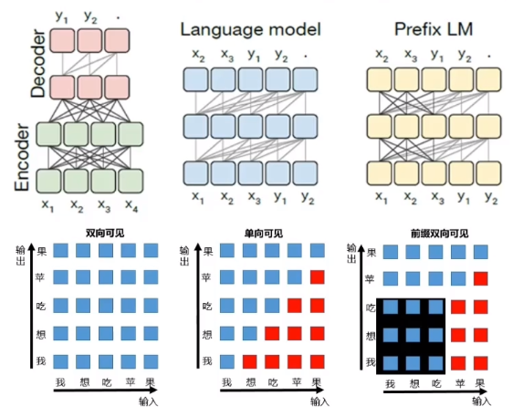

## T5作用
T5 （Transfer Text-to-Text Transformer），
T5将任务指令设定在输入文本中，就**不需要针对每类任务单独设置特定的FC输出层**，所有任务都输出text。

通过这样的方式就能**将 NLP 任务都转换成 Text-to-Text 形式**，也就可以用同样的模型，同样的损失函数，同样的训练过程，同样的解码过程来完成所有 NLP 任务。

## T5架构
T5模型作者通**过大量实验探索最佳的结构与训练方案**。

- **不同模型结构比较**，**LM，BERT-style，Deshuffling**，BERT-style的encoder-decoder模型一般比decoder-only（LM）好；
- 不同目标函数比较，**BERT-style denoising objective**最好；
- 不同**corruption rate（MLM**比较，10%，15%，25%，50%，15%最好；
- 不同**corrupted span length**比较，2，3，5，10，长度为3最好；
- 训练集数据重复比较；
- 训练策略比较：**先pretrain再fine-tune的multitask learning**非常有竞争力，但是需要谨慎选择不同任务训练频次；
- 模型规模比较：比较了不同size的模型（base，small，large，3B和11B），训练时间，以及融合模型，来决定如何充分利用计算性能。

#### 三种语言模型结构：
第一种，**Encoder-Decoder 型(Transformer)**，即 Seq2Seq 常用模型，分成 Encoder 和 Decoder 两部分，对于 Encoder 部分，输入可以看到全体，之后结果输给 Decoder，而 Decoder 因为输出方式只能看到之前的。（Encoder-Decoder结构中，**Encoder部分采用fully-visible attention mask，而Decoder部分采用causal attention mask**）

第二种，**Language Model型(GPT)**， 相当于上面的 Transformer Decoder 部分，当前时间步只能看到之前时间步信息。典型代表是 GPT2 还有最近 CTRL 这样的（Language model结构中，采用**causal attention mask**）

第三种，**前缀双向可见 Prefix LM 型**，可看作是上面 Encoder 和 Decoder 的融合体，一部分如 Encoder 一样能看到全体信息，一部分如 Decoder 一样只能看到过去信息。最近开源的 UniLM 便是此结构。（最右侧的Prefix LM结构中，**采用causal with prefix attention mask**）

通过实验作者们发现，在提出的这个 Text-to-Text 架构中，**Encoder-Decoder 模型效果最好**。于是乎，就把它定为 T5 模型，因此所谓的 T5 模型其实就是个 Transformer 的 Encoder-Decoder 模型（12层Encoder、12层Decoder）。

T5模型和原始的Transformer结构基本一致，除了做了如下几点**改动**：

**remove the Layer Norm bias**，因为在Transformer中，Layer Norm的bias是没有意义的，因为它只会影响到激活函数的输入，而不影响输出。
**place the Layer Normalization outside the residual path**，在Transformer中，Layer Norm是在残差连接之后，而在T5中，**Layer Norm是在残差连接之前**。
**use a different position embedding**

**模型完整架构**：

#### 相对位置编码

**在第一个block的self-attention计算中，直接把relative_position_bias加在score上**。
计算方法：在计算当前token和目标token的attention值时，记录两个token的距离的绝对值，我们**不直接使用这个距离值，而是根据距离值的大小进行一定程度的缩小，距离值越大缩小倍数越大**，距离值越小缩小倍数越小。具体实现时，**采用一种bucket"分桶"的方法，即对于临近距离应分到不同的桶中，分别进行精细编码；对于稍远距离应分到同一个桶中，共用一个编码**；对于更远距离则共用范围更大一些；对于超出限定距离则clip截断。

#### 训练方法比较

#### T5微调方法

**不冻结模型训练效果最佳，但缺点是慢！Adapter layers效果比Gradual unfreezing效果更好。**

## 学习资源
**论文解读**:https://blog.csdn.net/weixin_54338498/article/details/132829816
**代码介绍**:https://blog.csdn.net/qq_43592352/article/details/137207472
**code**:https://github1s.com/huggingface/transformers/blob/main/src/transformers/models/t5/modeling_t5.py

